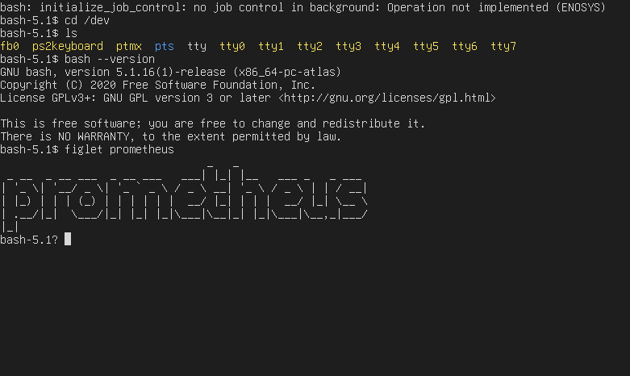

# Prometheus

A hobby operating system for the x86\_64 arch using the atlas kernel.

## Getting Started

### Tools

* xorriso
* git
* [xbstrap](https://github.com/managarm/xbstrap)
* qemu
* meson

### Installing

To run this OS:

* make sure you have the tools listed above
* Clone the repo
* make a `build` dir and cd `build`
* run `xbstrap install bash gcon coreutils figlet` 
* inside project rootdir, run `make rootdir`
* `make run` will start up the os in qemu

## Current functionality

* Basic round robin scheduler
* Virtual Filesystem (in progress)
* Physical memory manager
* Paging
* Keyboard and video driver
* PTY/TTY drivers
* Pre-emptive multitasking
* Loading elf binaries
* Running userspace programs

## Ports
* bash
* [gcon](https://github.com/streaksu/gcon)
* coreutils (in progress)
* figlet

## Third party code
- C library: [mlibc](https://github.com/managarm/mlibc)
- In kernel printf:  [printf](https://github.com/mpaland/printf)

## References

- [SysV ABI](https://refspecs.linuxbase.org/elf/x86_64-abi-0.99.pdf)
- [NetBSD VFS](https://man.netbsd.org/vfs.9)
- [ELF Specification](https://refspecs.linuxfoundation.org/elf/elf.pdf)
- [AMD Manual](https://www.amd.com/system/files/TechDocs/24593.pdf)

## License

This project is licensed under the MIT License - see the LICENSE file for details

